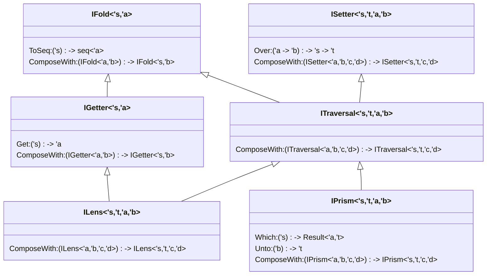

# FsOptics
Lenses/Prisms/Traversals/etc. with an emphasis on usability in the F# programming environment

## Design Goals
The purpose of this project is to create an optics library that fits as well as possible into idiomatic F# code.  This is largely accomplished by a combination of an explicitly defined interface hierarchy for the main optics types, and complimented by extension methods to allow for composing optics using a Fluent-like interface.  This is a large departure from the [lens](https://hackage.haskell.org/package/lens) or [optics](https://github.com/well-typed/optics) libraries in Haskell, which rely on a much more powerful type system (and thus are capable of expressing far more that can be done within the confines of the dotnet type system).

That said, it is still possible to create very useful optics expressions, especially when paired with recursive type structures (as seen in FsOptics.Json) or code generation (as is done in FsGrpc). 