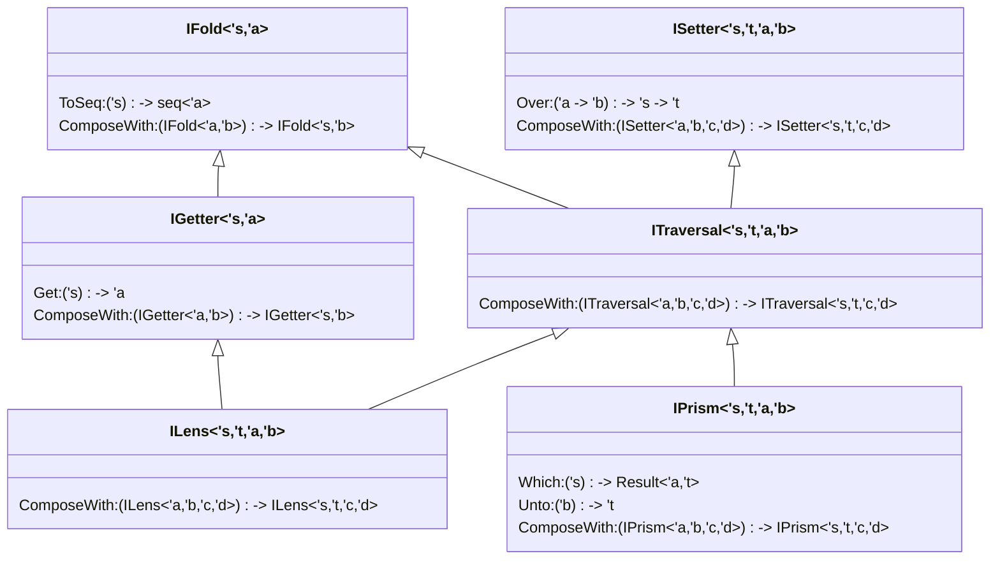

# Focal
Lenses/Prisms/Traversals/etc. with an emphasis on usability in the F# programming environment

## Design Goals
The purpose of this project is to create an optics library that fits as well as possible into idiomatic F# code.  This is largely accomplished by a combination of an explicitly defined interface hierarchy for the main optics types, and complimented by extension methods to allow for composing optics using a Fluent-like interface.  The instances of said interfaces are implemented as records of matching fuctions.  This is a large departure from the [lens](https://hackage.haskell.org/package/lens) or [optics](https://github.com/well-typed/optics) libraries in Haskell.  In exchange for a reduced level of expressiveness, we are able to make heavy use of the auto-complete features available for F# in VSCode and Visual Studio.

## Examples

[JSON Examples](JsonExamples.md)

